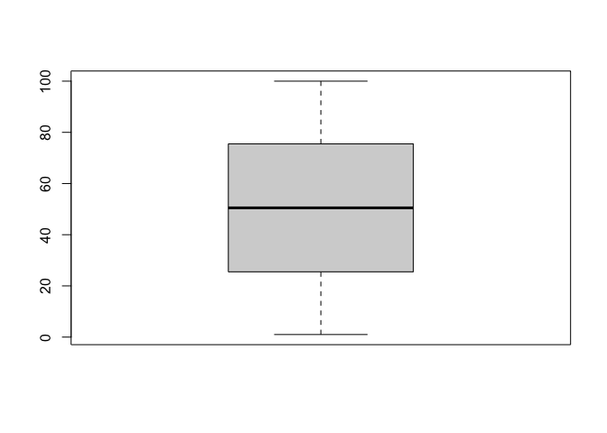
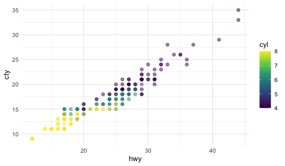

# Quarto学习笔记
杜俊宏
2023年11月10日 00:00

- [<span class="toc-section-number">1</span> 前言](#前言)
- [<span class="toc-section-number">2</span> 快捷键](#快捷键)
- [<span class="toc-section-number">3</span>
  页面样式设置](#页面样式设置)
- [<span class="toc-section-number">4</span> 代码块设置](#代码块设置)
- [<span class="toc-section-number">5</span> 图片设置](#sec-图片设置)
- [<span class="toc-section-number">6</span> 交叉引用](#sec-交叉引用)
- [<span class="toc-section-number">7</span>
  插入参考文献](#插入参考文献)
- [<span class="toc-section-number">8</span>
  插入Callouts](#插入callouts)
- [<span class="toc-section-number">9</span>
  插入在线视频](#插入在线视频)
- [<span class="toc-section-number">10</span> 输出](#输出)
- [<span class="toc-section-number">11</span> 发布到GitHub
  Pages](#发布到github-pages)

**本教程网址：<https://djhcod.github.io/Quarto-foundation.github.io/>。**

# 前言

Quarto是一个支持多种编程语言的新一代R
Markdown，拥有数十个新的特性和功能，同时能够兼容和渲染大多数现有的RMD文件，而无需额外修改。目前，Quarto还处于起步和不断发展的阶段，针对其的学习资源还十分有限，尤其是中文资源更加匮乏，因此才有了汇总和编写这篇学习笔记的动机。这篇学习笔记主要参考了[Quarto的官方指南](https://quarto.org)，并提取了其中我认为在将来的编写中会经常使用的技巧并加以汇总。这篇文档即全程采用Quarto编写。

Quarto主要由三大部分组成：metadata, text, 和
code。其中metadata是文档开头写在”---“之间的句子，它采用的是[YAML语法](https://en.wikipedia.org/wiki/YAML)，所以有时候也别叫做YAML
metadata 或者 the YAML
frontmatter。YAML定义了Quarto的性质，比如title、author、date、指定output文件类型等。在YAML
metadata中采用正确的缩进十分重要。

<div>

> **Note**
>
> 有关Quarto的详细信息，参考：<https://quarto.org>.

</div>

<https://youtu.be/_f3latmOhew>

# 快捷键

- 插入代码块：`Option`+`Command`+`I`（macOS）；`Ctrl`+`Alt`+`I`（Windows）。

- 插入各类对象：`Command`+`/`；或者当光标位于新的一行开头时，直接输入`/`。

# 页面样式设置

## 更改标题栏的样式

<div>

> **Tip**
>
> 有关标题栏的详细指南，参考：<https://quarto.org/docs/authoring/title-blocks.html>。

</div>

打开标题栏的横幅：

``` r
---
format: 
  html:
    title-block-banner: true
---
```

自定义标题栏的背景。既可以自定义背景颜色，也可以将图片作为标题栏的背景。可以通过`title-block-banner-color`来自定义标题文字的颜色。

``` r
---
# title-block-banner: "#FFDDFF"
title-block-banner: images/banner.jpeg
title-block-banner-color: "black"
---
```

## 更改日期格式

通过`date`添加文档的发行日期，通过`date-modified`添加文档的修改日期，通过`date-format`修改日期格式。其中，`date`的默认标签为”PUBLISHED
DATE”，可以通过`published-title`来修改默认标签，如：`published-title: 写作日期`。下面是一个典型的日期定义语法：

``` r
{r}
---
title: Quarto基础
author: 杜俊宏
date: 2023/11/10
date-modified: now
date-format: "YYYY[年]M[月]D[日] HH:mm"
---
```

<div>

> **Tip**
>
> 关于日期的详细指南，详见：<https://quarto.org/docs/reference/dates.html>。

</div>

日期既可以手动添加，如”2023/11/10”，也可以自动生成日期。下面是自动生成不同日期格式的关键词：

<div id="tbl-自动生成日期">

| 关键词          | 效果                                                                   |
|-----------------|------------------------------------------------------------------------|
| `today`         | 2023年11月11日                                                         |
| `now`           | 2023年11月11日 19:01                                                   |
| `last-modified` | The last modified date and time of the input file containing the date. |

表 1： 自动生成日期

</div>

`date-format`通过以下关键词来定义日期格式：

<div id="tbl-日期格式">

| Style    | Description                                 | Example               |
|----------|---------------------------------------------|-----------------------|
| `full`   | A full date that includes the weekday name  | Monday, March 7, 2005 |
| `long`   | A long date that includes a wide month name | March 7, 2005         |
| `medium` | A medium date                               | Mar 7, 2005           |
| `short`  | A short date with a numeric month           | 3/7/05                |
| `iso`    | A short date in ISO format                  | 2005-03-07            |

表 2： 定义日期格式

</div>

也可以通过以下语法更加灵活的定义日期格式：

<div id="tbl-自由定制日期格式">

| **ormat String** | **Output**       | **Description**                       |
|------------------|------------------|---------------------------------------|
| `YY`             | 18               | Two-digit year                        |
| `YYYY`           | 2018             | 四位数年份                            |
| `M`              | 1-12             | The month, beginning at 1             |
| `MM`             | 01-12            | 两位数月份                            |
| `MMM`            | Jan-Dec          | The abbreviated month name            |
| `MMMM`           | January-December | The full month name                   |
| `D`              | 1-31             | The day of the month                  |
| `DD`             | 01-31            | 两位数日期                            |
| `d`              | 0-6              | The day of the week, with Sunday as 0 |
| `dd`             | Su-Sa            | The min name of the day of the week   |
| `ddd`            | Sun-Sat          | The short name of the day of the week |
| `dddd`           | Sunday-Saturday  | The name of the day of the week       |
| `H`              | 0-23             | The hour                              |
| `HH`             | 00-23            | 两位数小时，24小时制                  |
| `h`              | 1-12             | The hour, 12-hour clock               |
| `hh`             | 01-12            | The hour, 12-hour clock, 2-digits     |
| `m`              | 0-59             | The minute                            |
| `mm`             | 00-59            | 两位数分钟                            |
| `s`              | 0-59             | The second                            |
| `ss`             | 00-59            | The second, 2-digits                  |
| `SSS`            | 000-999          | The millisecond, 3-digits             |
| `Z`              | +05:00           | The offset from UTC, ±HH:mm           |
| `A`              | AM PM            |                                       |
| `a`              | am pm            |                                       |
| `Do`             | 1st 2nd … 31st   | Day of Month with ordinal             |

表 3： 自由定义日期格式

</div>

可以通过”\[\]“添加自定义字符。通过这些语法，可以定制符合中文的日期格式，如：`date-format: "YYYY[年]M[月]D[日] HH:mm"`

# 代码块设置

## 全局设置

- `eval`：设置为`false`时只显示代码，不运行。默认为`true`。

- `echo`：设置为`false`时在输出文件中不显示代码，仅显示代码的运行结果。设置为`fenced`，会将代码块的设置，即”#\|“符号后的内容，也展示出来。[图 1](#fig-箱型图)
  这个代码块就用了`echo: fenced`这个设定，可以看一下效果。默认为`true`。

- `output`：设置为`false`时，只运行代码不显示运行结果。默认为`true`。

- `warning`：是否显示代码运行的警告信息。默认为`true`。

- `freeze`：在重新导出文档时是否冻结此前已经运行的结果。设置为`true`，则每次导出时不会再此运行此前已经得到运行结果的代码块。设置为`auto`，则仅在源文件发生更改时才重新计算以前生成的计算结果。默认为`false`。

- `code-fold`: 是否折叠代码（适用于HTML渲染）。

- `code-tools`: 是否在网页右上角显示代码工具（适用于HTML渲染）。

- `code-link`:
  是否自动为函数加上超链接（适用于HTML渲染）。该功能基于[downlit](https://downlit.r-lib.org/)包，可以自动为识别到的函数加上一个链接到官方文档的超链接。

``` r
---
title: "Quarto Computations"
execute:
    eval: false
    warning: false
format:
  html:
    code-fold: true
    code-tools: true
---
```

## 单独设置每个代码块

基本语法和全剧设置一致，只不过需要在每个参数前加上”#\|“符号。

可以在代码块的开头添加`label`和`caption`参数，这样在交叉引用时就会显示该标签。详见
[章节 6](#sec-交叉引用) 。

```` markdown
```{r}
#| eval: true
#| label: fig-箱型图
#| fig-cap: 1到100的箱型图
boxplot(1:100)
```
````



## 代码块图片输出设置

- `lable`：图片标签。

- `fig-cap`：图片标题（`caption`）。`fig-cap`和`lable`共同用于图片的交叉引用，详见
  [章节 6](#sec-交叉引用)。

- `fig-width`：图片的宽度。

- `fig-height`：图片的高度。

其他设置包括`fig-align`、`fig-cap-location`等，见
[章节 5](#sec-图片设置)。

```` markdown
```{r}
#| eval: true
#| label: fig-散点图
#| fig-cap: "38种流行车型的城市和高速公路里程"
#| fig-width: 6
#| fig-height: 3.5
library(ggplot2)
ggplot(mpg, aes(x = hwy, y = cty, color = cyl)) +
  geom_point(alpha = 0.5, size = 2) +
  scale_color_viridis_c() +
  theme_minimal()
```
````



### 代码块组图输出设置

`label`：组图的标签

`fig-cap`：每张图的标题。通过”-“符号分别设置。效果如下所示：

```` markdown
```{r}
#| eval: true
#| layout-ncol: 2
#| label: fig-组图输出
#| fig-cap:
#|   - "车辆的速度和停车距离"
#|   - "汽压与温度的关系"

plot(cars)
plot(pressure)
```
````


`fig-subcap`：每张图以小标题进行标注，如”*(a) sub caption”*、“*(b) sub
caption”*。效果如下所示：

```` markdown
```{r}
#| eval: true
#| label: fig-小标题组图输出
#| fig-cap: "小标题组图输出"
#| fig-subcap:
#|   - "汽车"
#|   - "压力"
#| layout-ncol: 2

plot(cars)
plot(pressure)
```
````


小标题组图输出

`layout-ncol`和`layout-nrow`：设置组图的行和列分别排多少张图片。如`layout-ncol: "2"`。

#### 用`layout`进行复杂排版

`layout`属性是一个二维数组，其中第一维定义行，第二维定义列。如`layout: "[[1，1]，[1]]`表示：创建两行，第一行有两列大小相等的列，第二行只有一列。

```` markdown
```{r}
#| eval: true
#| label: fig-输出复杂排版图片
#| fig-cap: 复杂排版组图输出
#| fig-subcap:
#|   - 汽车
#|   - 压力
#|   - mtcars
#| layout: [[1], [1, 1]]

plot(cars)
plot(pressure)
plot(mtcars)
```
````


复杂排版组图输出

`layout`后的”\[\]“中的数字大小表示各个图像的相对大小。所以可以用任何值来自定义：

```` markdown
```{r}
#| eval: true
#| label: fig-输出复杂排版图片2
#| fig-cap: 复杂排版组图输出2
#| fig-subcap:
#|   - 汽车
#|   - 压力
#|   - mtcars
#| layout: [[100], [30, 70]]

plot(cars)
plot(pressure)
plot(mtcars)
```
````


复杂排版组图输出2

如果我们输入负数，如下面的”-10”，则会在两个图之间加上相应的间距：

```` markdown
```{r}
#| eval: true
#| label: fig-输出复杂排版图片3
#| fig-cap: 复杂排版组图输出3
#| fig-subcap:
#|   - 汽车
#|   - 压力
#|   - mtcars
#| layout: [[45,-10, 45], [100]]

plot(cars)
plot(pressure)
plot(mtcars)
```
````


复杂排版组图输出3

# 图片设置

图片可以通过复制粘贴直接插入，Quarto定义图像的基本语法是：

`{#fig-elephant width="290"}`。

其中，方括号内的是对象的`caption`，小括号内是对象的本地链接，“{}”内的内容是图像的`label`以及其他可选设置，各参数间用空格进行分割。常用的图像设置如下：

- `width`和`height`：图像的宽、高。默认单位为像素。

- `fig-align`：图片的对齐方式，如”left”，“right”。建议在YAML中进行全局设置：

  ``` r
  ---
  title: "My Document"
  format:
    pdf:
      fig-pos: 'h'
  ---
  ```

- `fig-cap-location`：图片标题的位置（默认在图片底部）。可选的值包括：

  | Value    | Description                            |
  |----------|----------------------------------------|
  | `top`    | Position the caption above the figure. |
  | `bottom` | Position the caption below the figure. |
  | `margin` | Position the caption in the margin.    |

  建议将其添加到YAML中，以便统一文稿的样式：

  ``` r
  ---
  title: "My Document"
  format:
    pdf:
      fig-pos: 'h'
      fig-cap-location: top
  ---
  ```

<div>

> **Tip**
>
> 在YAML中可以分别设置图片和表格的标题以及参考文献、脚注的位置。其语法如下：

</div>

<div id="tbl-设置图表的标题">

<table>
<caption>表 4： 设置图、表的标题</caption>
<colgroup>
<col style="width: 14%" />
<col style="width: 85%" />
</colgroup>
<thead>
<tr class="header">
<th>Option</th>
<th>Description</th>
</tr>
</thead>
<tbody>
<tr class="odd">
<td><code>reference-location</code></td>
<td>Where to place footnotes. Defaults to <code>document</code>.<br />
[<code>document</code> | <code>section</code> | <code>block</code> | <code>margin</code> ]</td>
</tr>
<tr class="even">
<td><code>citation-location</code></td>
<td>Where to place citations. Defaults to <code>document</code>.<br />
[<code>document</code> | <code>margin</code> ]</td>
</tr>
<tr class="odd">
<td><code>cap-location</code></td>
<td>Where to place figure and table captions. Defaults
to <code>bottom</code> for figures and <code>top</code> for tables. |
[<code>top</code> | <code>bottom</code> | <code>margin</code>]</td>
</tr>
<tr class="even">
<td><code>fig-cap-location</code></td>
<td>Where to place figure captions. Defaults
to <code>bottom</code>.<br />
[<code>top</code> | <code>bottom</code> | <code>margin</code>]</td>
</tr>
<tr class="odd">
<td><code>tbl-cap-location</code></td>
<td>Where to place table captions. Defaults to <code>top</code>.<br />
[<code>top</code> | <code>bottom</code> | <code>margin</code>]</td>
</tr>
</tbody>
</table>

表 4： 设置图、表的标题

</div>

- 可以在小括号内添加超链接，如`[](https://en.wikipedia.org/wiki/Elephant)`，当点击该图像时会跳转该网站。

- `caption`和`label`的设置会使该图像能够被交叉引用（详见
  [章节 6](#sec-交叉引用) ）。

- `.column-page`：让图片以整个文档的宽度展示。需要首先建立一个Pandoc
  Div块（[图 16](#fig-div)）。然后在Pandoc
  Div块的参数项内填上`{.column-page}`。如下所示：

  ``` r
  :::{.column-page}
  
  :::
  ```

  这样这张图片就会以文档最大宽度显示：

<div class="column-page">


</div>

<div>

> **Note**
>
> 应用于代码块时为：`#| column: page`

</div>

- `.column-screen`：让图片占满整个网页的宽度。应用于代码块时为：`#| column: screen`。

<div class="column-screen">


</div>

- `column-screen-inset-shaded`：让图片以整个文档的宽度展示，但是在后方加上一个网页宽度的阴影。应用于代码块时为：`#| column: screen-inset-shaded`。

<div class="column-screen-inset-shaded">


</div>

## 组图的设置

要容纳和排版组图，需要首先建立一个Pandoc Div块（[图 16](#fig-div)）。


Div块的图像排版基本语法如下：


- “{}”内为组图的label、排版设置。

- 在所有图片最后可输入组图的标题，如上面的”交叉引用的设置”。

设置图片的排版方式。

`layout-ncol`和`layout-nrow`：设置组图的行和列分别排多少张图片。如`::: {layout-ncol="2"}`。

<div>

<table>
<colgroup>
<col style="width: 41%" />
<col style="width: 58%" />
</colgroup>
<tbody>
<tr class="odd">
<td style="text-align: center;"><div width="41.4%"
data-layout-align="center">
<p></p>
</div></td>
<td style="text-align: center;"><div width="58.6%"
data-layout-align="center">
<p></p>
</div></td>
</tr>
</tbody>
</table>

<table>
<colgroup>
<col style="width: 47%" />
<col style="width: 52%" />
</colgroup>
<tbody>
<tr class="odd">
<td style="text-align: center;"><div width="47.5%"
data-layout-align="center">
<p></p>
</div></td>
<td style="text-align: center;"><div width="52.5%"
data-layout-align="center">
<p></p>
</div></td>
</tr>
</tbody>
</table>

</div>

### `Layout`复杂排版

其基本语法和 [章节 4.3.1](#sec-代码块组图输出设置)
一致。不同点在于需要在Div块开头的”{}“内设置，同时`layout`后要接”=“，同时要注意加引号，例如：`layout="[[1，1]，[1]]"`。通过设置`layout`可以完成对多图的复杂排版。`layout`属性是一个二维数组，其中第一维定义行，第二维定义列。`layout="[[1，1]，[1]]"`表示：创建两行，第一行有两列大小相等的列，第二行只有一列。

<div id="组图复杂排版设置">

<table>
<colgroup>
<col style="width: 50%" />
<col style="width: 50%" />
</colgroup>
<tbody>
<tr class="odd">
<td style="text-align: center;"><div width="50.0%"
data-layout-align="center">
<p></p>
</div></td>
<td style="text-align: center;"><div width="50.0%"
data-layout-align="center">
<p></p>
</div></td>
</tr>
</tbody>
</table>

<table>
<colgroup>
<col style="width: 100%" />
</colgroup>
<tbody>
<tr class="odd">
<td style="text-align: center;"><div width="100.0%"
data-layout-align="center">
<p></p>
</div></td>
</tr>
</tbody>
</table>

<table>
<colgroup>
<col style="width: 100%" />
</colgroup>
<tbody>
<tr class="odd">
<td style="text-align: center;"><div width="100.0%"
data-layout-align="center">
<p>组图复杂排版设置</p>
</div></td>
</tr>
</tbody>
</table>

</div>

<div>

> **Note**
>
> 关于图片的详细指南，参考：<https://quarto.org/docs/authoring/figures.html>。

</div>

# 交叉引用

如果要使用交叉引用，则每个待引用对象需要有以下两个元素：

- `label`：标签。**必须以类型为前缀，如#fig-1、#tbl-1、#fig-boxplot。同时，标签名不能重复。**

- `caption`：对内容的描述。

拥有了这两个元素的对象会被自动加上序号，如Figure 1，并可以被交叉引用。
可引用的对象包括：图表、公式、章节、代码和定理等。注意在交叉引用时要在两端加上空格。

<div>

> **Tip**
>
> 有关交叉引用的详细指南，参考：<https://quarto.org/docs/authoring/cross-references.html>。

</div>

## 标题/节的交叉引用

只需通过`sec-`定义`label`，基本语法：Introduction
`{#sec-introduction}`。注意：要使用节的引用，需要在YAML开启标题编号（`number-sections: true`），以便读者能够看到这些编号。

## 图片的交叉引用

实现的方法：

- 方法一：在源代码模式下修改被引用对象的属性，如：`{#fig-elephant width="290"}`。其中，方括号内的是对象的`caption`，小括号内是对象的本地链接，“{}”内的内容是图像的`label`以及其他可选设置。
- 方法二：点击待引用对象右上角的三个点，进入对象设置。分别输入`caption`和ID（即`label`）（[图 18](#fig-demo)
  )。

<div id="fig-demo">

<table>
<colgroup>
<col style="width: 49%" />
<col style="width: 50%" />
</colgroup>
<tbody>
<tr class="odd">
<td style="text-align: center;"><div width="49.6%"
data-layout-align="center">
<p></p>
</div></td>
<td style="text-align: center;"><div width="50.4%"
data-layout-align="center">
<p></p>
</div></td>
</tr>
</tbody>
</table>

图 18： 交叉引用的设置

</div>

例如下面的图片，可以被引用：[图 19](#fig-elephant) 。


### 组图的交叉引用

基本语法：


案例：

<div id="fig-组图的交叉引用">

<table>
<colgroup>
<col style="width: 42%" />
<col style="width: 57%" />
</colgroup>
<tbody>
<tr class="odd">
<td style="text-align: center;"><div width="42.9%"
data-layout-align="center">
<p></p>
</div></td>
<td style="text-align: center;"><div width="57.1%"
data-layout-align="center">
<p></p>
</div></td>
</tr>
</tbody>
</table>

图 20： 组图的交叉引用

</div>

现在，我们就可以将组图一起引用（[图 20](#fig-组图的交叉引用)
），或是单独引用组图内的某一张图（[图 20 (B)](#fig-组图-油画大象)
，[图 20 (A)](#fig-组图_素描大象) ）。

## 表格的交叉引用

### Markdown表格的引用

只需在表格后加上`: My Caption {#tbl-letters}`即可使该表格能够被引用。如下面的表格
[表 5](#tbl-表格交叉引用) 。

<div id="tbl-表格交叉引用">

| Col1 | Col2 | Col3 |
|------|------|------|
| A    | B    | C    |
| E    | F    | G    |
| A    | G    | G    |

表 5： 表格的交叉引用示例

</div>

### 代码输出表格的引用

- `label：tbl-`：表格的标签。

- `tbl-cap`：表格的标题。

- knitr包提供了一个 `kable()` 函数可以用来把数据框或矩阵转化成有格式的表格，
  支持HTML、docx、LaTeX等格式。

```` markdown
```{r}
#| eval: true
#| label: tbl-iris
#| tbl-cap: "Iris数据"

library(knitr)
kable(head(iris))
```
````

<div id="tbl-iris">

| Sepal.Length | Sepal.Width | Petal.Length | Petal.Width | Species |
|-------------:|------------:|-------------:|------------:|:--------|
|          5.1 |         3.5 |          1.4 |         0.2 | setosa  |
|          4.9 |         3.0 |          1.4 |         0.2 | setosa  |
|          4.7 |         3.2 |          1.3 |         0.2 | setosa  |
|          4.6 |         3.1 |          1.5 |         0.2 | setosa  |
|          5.0 |         3.6 |          1.4 |         0.2 | setosa  |
|          5.4 |         3.9 |          1.7 |         0.4 | setosa  |

表 6： Iris数据

</div>

现在，就可以通过 [表 6](#tbl-iris) 来引用该表格了。

<div>

> **Note**
>
> 关于表格的详细指南，参考：<https://quarto.org/docs/authoring/tables.html>。

</div>

## 更改交叉引用样式

``` r
---
title: Quarto基础
crossref:
  fig-title: 图     # 图的默认标签（默认是"Figure"）
  tbl-title: 表     # 表的默认标签（默认是"Table"）
  title-delim: "—"   # “图/表”和后面的标题之间的连接符（默认是":"）
  fig-prefix: 图   # 图的默认引用样式（默认是"Figure"）
  tbl-prefix: 表    # 表的默认引用样式（默认是"Table"）
  sec-prefix: 章节 # 章节的默认引用样式（默认是“Section”）
---
```

还可以更改编号的类型：

``` r
---
title: Quarto基础
crossref:
  fig-labels: arabic    # 图片的编号类型（默认是阿拉伯数字：arabic)
  tbl-labels: arabic    # 表格的编号类型（默认是阿拉伯数字：arabic）
  subref-labels: alpha A # 次级引用的编号类型，如组图中的小图（默认是小写字母：alpha a）
---
```

可用的编号类型包括：

- `arabic` (1, 2, 3)

- `roman` (I, II, III, IV)

- `roman i` (i, ii, iii, iv)

- `alpha x` (start from letter ‘x’)

- `alpha X` (start from letter ‘X’)

# 插入参考文献

在插入菜单中选择”Citation”：


然后通过DOI或标题检索参考文献，选择目标文献：


现在就会出现参考文献的交叉引用，如： (Fujii et al. 2023)
。并且会在文档最后生成参考文献列表，同时YAML中会新增参考文献的配置选项：`bibliography: references.bib`。同时根目录下会生成一个名为”references.bib”的参考文献配置文件。

如果想改变参考文献展示的位置，可以在YAML中设置，如：

``` r
---
citation-location: margin
---
```

可用的值参见 [表 4](#tbl-设置图表的标题)
。这份文档的参考文献就设置为了在页面最后展示（`citation-location: document`）。

<div>

> **Note**
>
> 关于参考文献和脚注的详细指南，参考：<https://quarto.org/docs/authoring/footnotes-and-citations.html>。

</div>

# 插入Callouts

**Callouts会生成一个标注框，可以用来标注重要内容：**


例如：

<div>

> **Tip**
>
> 这是一个Callouts示例。

</div>

**其样式包括：**

- `callout-note`

  

- `callout-tip`

  

- `callout-important`

  

- `callout-caution`

  

- `callout-warning`

  

# 插入在线视频

通过一下语法可以在输出文档中插入可直接播放的在线视频：

``` r

```

# 输出

渲染Quarto文档时，首先[knitr](http://yihui.name/knitr/)将运行所有代码块，并创建一个新的markdown（.md）文档，其中包括源代码及其输出结果。接下来，生成的markdown文件经过[pandoc](http://pandoc.org/)（RStudio内置了pandoc）处理后，被转换成HTML、PDF或者Word等我们需要的文档格式。RStudio封装了这些操作，当我们完成Quarto编辑，点击渲染时，就会完成上述过程。

<span class="smallcaps">*Quarto的渲染工作流*</span>


Pandoc支持大量的输出格式，所有这些格式都可以与Quarto一起使用。导出设置通过在YAML中使用`format`命令完成。关于各种导出格式的设置详见：<https://quarto.org/docs/output-formats/all-formats.html>。下面是导出设置的基本YAML语法：

``` r
title: "标题"
author: "杜俊宏"
format:
  html:
    toc: true
    html-math-method: katex
    css: styles.css
```

## HTML输出

### 基本信息设置

可在文档开头添加的信息包括：

- title

- subtitle

- date

- date-modified

- author

- abstract

``` r
title: "R Markdown的基础知识"
author: "杜俊宏"
date: "创建日期：2023/11/8；最后更新日期：`r format(Sys.time(), '%Y/%m/%d %H:%M')`"
```

### `them`：定义HTML主题

可以通过设置them参数来定义输出的HTML文档的主题。关于Quarto主题的详细说明，见：<https://quarto.org/docs/output-formats/html-themes.html>。

- `theme: default` \# bootstrap 5 default

- `theme: cosmo` \# cosmo bootswatch theme

- `theme: pandoc` \# pandoc default html treatment

- `theme: none` \# no theme css added to document

Quarto的HTML文档默认使用Bootstrap
5样式输出。Quarto内置了来自[Bootswatch](https://bootswatch.com)项目的25个主题。下面列出了可用的主题。关于这些主题的介绍详见：<https://bootswatch.com>。


个人认为比较美观、清晰的主题有：**Cosmo、Flatly和Darkly。可以通过**`light`和`dark`**分别设置一套亮色主题和一套深色主题，如：**

``` r
theme:
  light: flatly
  dark: darkly
```

这样，在输出的HTML网页的右上角会出现一个亮色/深色模式的切换开关。

### `toc`：目录设置

- `toc-depth`：设置目录显示的最低层级（默认为显示到3级标题）

- `toc-expand`：在一开始目录显示到多少级，默认显示到一级标题。当向下浏览内容时目录会自动展开到`toc-depth`所设置的层级。设置为`true`时，则在一开始就展开所有目录；设置为`false`则在一开始折叠所有目录。

- `toc-title`：目录的标题。

- `toc-location`：设置目录的位置。默认在右侧（`right`）,可以设置为`left`或`body`（在文稿最开头显示）。

``` r
toc: true
toc-title: Contents
toc-depth: 2 
toc-expand: 2 
toc-location: left
```

### `title-block-banner`：标题横幅设置。

title-block-banner有以下选项：

- true：将标题以网页横幅的形式展示，样式为them中所选样式的默认样式。

- 具体颜色：如`title-block-banner: "#003262"`。

- 图片路径：如`title-block-banner: images/banner.jpeg`。

### `number-sections`：设置标题编号

- `number-sections`:设置为`true`时会给各级标题编号。默认为`false`。

- `number-depth`:编号的最低标题层级。默认给所有级别的标题编号。

- `{.unnumbered .unlisted}`：如果想要某一个标题不编号，则把这行命令粘贴到该标题后面。如”第三章{.unnumbered
  .unlisted}“。

``` r
number-sections: true
number-depth: 3
```

### `code-copy`：设置代码复制按钮

- `true`: 总是在代码块右上角显示代码复制按钮。

- `false`: 隐藏代码复制按钮。

- `hover`：（默认）当鼠标移过时显示代码复制按钮。

### 内部与外部链接样式

- `anchor-sections`: 设置为true时，当鼠标移到标题上时会显示anchor link。

- link-external-icon：设置为true时会在外部链接上显示一个小图标。

- link-external-newwindow：是否在新标签页打开外部链接。

## GitHub Flavored Markdown（GFM）格式输出

我们可以将Quarto文档转换为GitHub风格的Markdown文档（GitHub Flavored
Markdown，GFM）。这可以用来生成GitHub项目的README.md文档。比如我这里直接将这个Quarto文档教程完整转换成了GitHub风格的markdown文件：

``` r
---
title: "My Project"
format: 
  gfm:
    identifier-prefix: readme # 标识符
    # preview-mode: raw # 查看原始markdown
    keep-yaml: true
    toc: true
    toc-depth: 1
    number-sections: true
    citation-location: document
    output-file: "README.md" # 输出文档的文件名
---
```

## PDF输出

如果要在rmarkdown、bookdown中使用PDF输出功能，
可以在在R中安装tinytex扩展包并安装TinyTeX编译软件：

``` r
install.packages('tinytex')
tinytex::install_tinytex()
```

其中上面第一行命令安装R的tinytex扩展包，
第二行将下载LaTeX编译程序的服务器设置为清华大学tuna镜像站，
第三行安装LaTeX编译程序。

如果安装成功， TinyTeX软件包在MS
Windows系统中一般会安装在 `C:\Users\用户名\AppData\Roaming\TinyTeX`目录中，
其中”用户名”应替换成系统当前用户名。 如果需要删除TinyTeX软件包，
只要直接删除那个子目录就可以。

为了判断TinyTeX是否安装成功， 在RStudio中运行：

``` r
tinytex::is_tinytex()
```

结果应为`TRUE`, 出错或者结果为`FALSE`都说明安装不成功。

当用户使用RMarkdown和tinytex包转换latex并编译为PDF时，
如果缺少某些latex宏包， tinytex会自动安装缺少的宏包。

# 发布到GitHub Pages

我们可以将我们的Quarto文档编译的HTML文档发布到GitHub
Pages中形成一个可以被其他人访问的网页。下面是具体实现方法。

1.  在GitHub首页创建一个新的仓库。

    

2.  给这个仓库起个名字。

    <div>

    > **Caution**
    >
    > 为了使这个项目能够创建网页，仓库的名字的后缀必须是".github.io"。

    </div>

3.  添加仓库的描述，这些描述会被添加到README.md文档中，选择仓库的权限为公开，创建README文件，并选择一个license。

    

4.  现在，我们就可以看到这个仓库就被建立了，我们们勾选的README文档和license文档出现在列表中。然后我们点击设置按钮。

    

5.  点击左侧导航栏的"Pages"选项，然后将我们的GitHub
    Pages的创建来源选择为根目录。

    

6.  现在我们就可以开始上传文件了。

    

7.  需要上传的的文件至少应该包括包括一个HTML文件（文件名为index.html）和一个HTML的资源文件夹（一般我们在Quarto中编译后为一个名称为"\_files”的文件夹）

    

    <div>

    > **Caution**
    >
    > - HTML文件的文件名必须为index.html，这样GItHub
    >   Pages才能识别这是一个用于构建网页的HTML文件。
    >
    > - 用Quarto编译HTML文件后，会在根目录生成一个文件名为为"Quarto文档的文件_files”的文件夹，这个就是HTML的资源文件。

    </div>

8.  上传完文件等待一段时间后，就可以在pages的设置页面看到我们的网站已经就绪了。

    

9.  点击这个网址即可访问我们建立的网页。

    

10. 下一步我们可以通过 [章节 10.2](#sec-github-markdown)
    中的方法来创建一个更详细的README文件，这个文件最终会展示在GitHub仓库的首页上。我这里直接将这个完整的教程转换成了GitHub风格的markdown文件。

<div id="refs" class="references csl-bib-body hanging-indent">

<div id="ref-fujii2023a" class="csl-entry">

Fujii, Kouichi, Jin Kikuchi, Masatoshi Uchida, Masanari Machida, Midori
Tsuchiya, Kentaro Hayashi, Nana Maekawa, Hajime Houzumi, Arata Honda,
and Koji Wake. 2023. “Tiger Attack at a Japanese Safari Park: A Case
Report.” *International Journal of Emergency Medicine* 16 (1).
<https://doi.org/10.1186/s12245-023-00556-3>.

</div>

</div>
